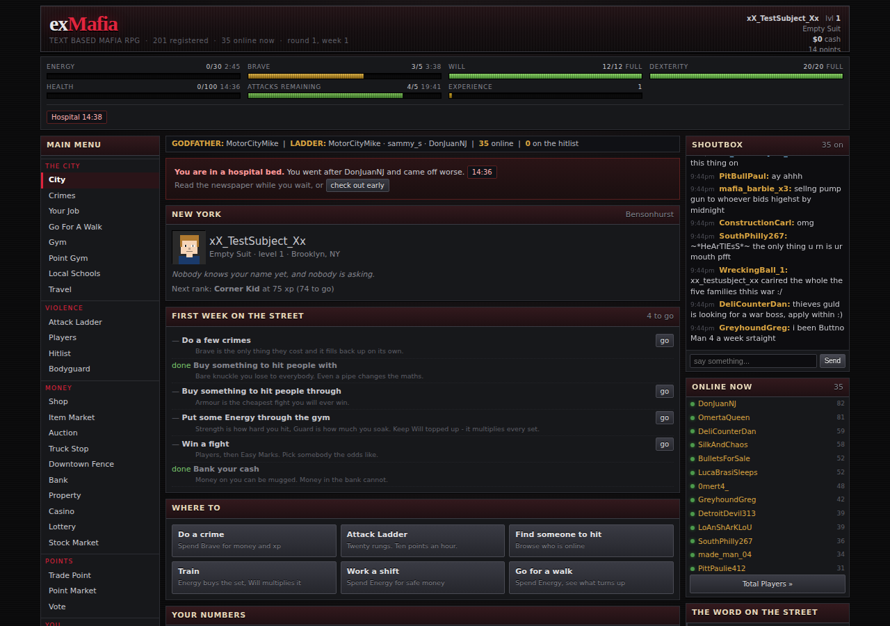
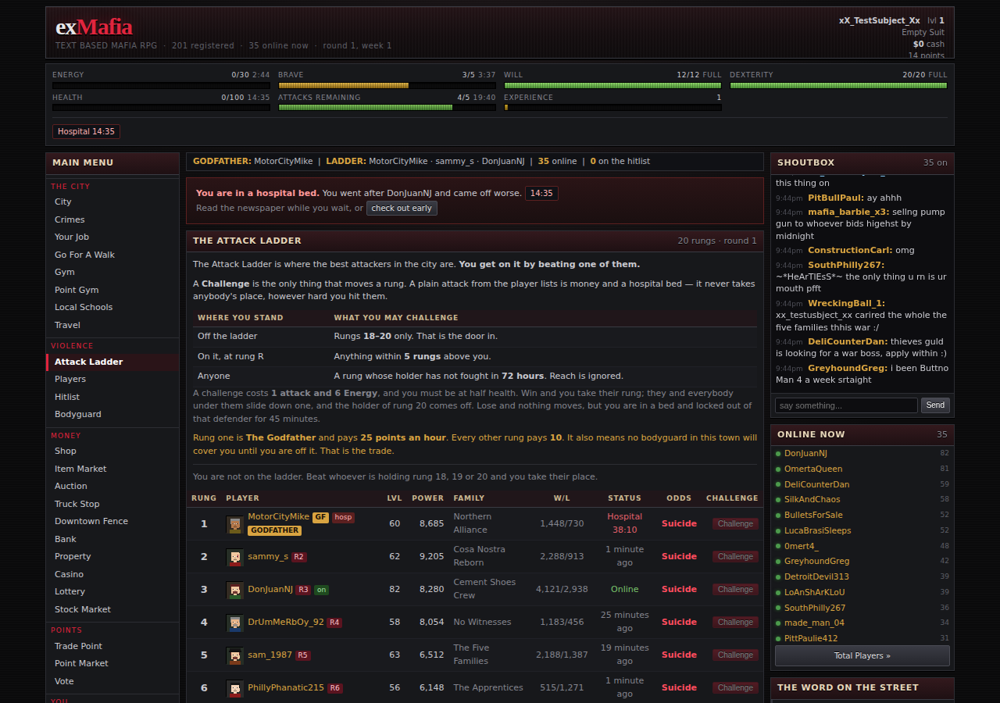
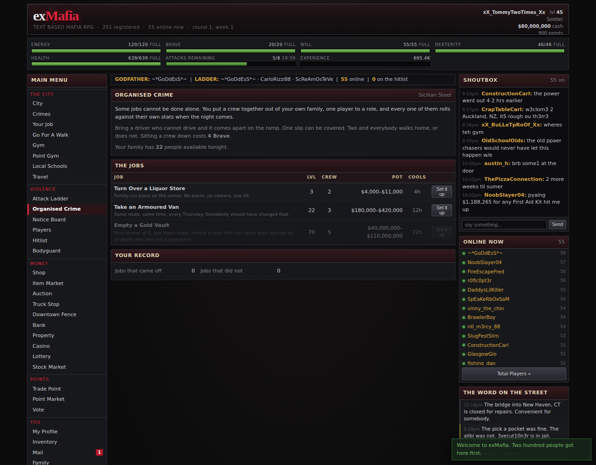
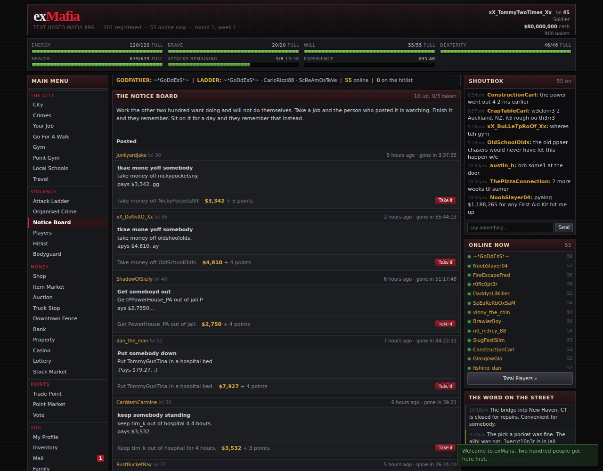
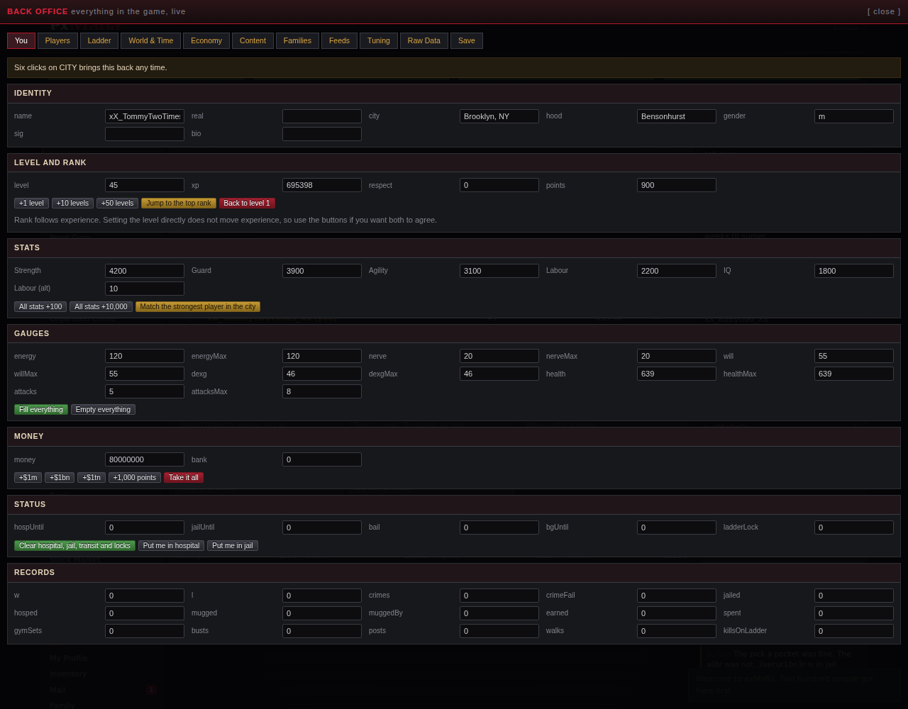

# exMafia — single player

A faithful offline recreation of **exMafia**, the 2D text-based mafia MMORPG that ran at
exmafia.com and as a MySpace application in the late 2000s.

**Open `exmafia.html`. That is the whole thing.** One file, no install, no server, no
internet. It saves to your browser automatically.



---

## What is in it

Two hundred other players. Not a leaderboard of names — two hundred accounts, each with its
own time zone, its own hours, its own temper and its own idea of how to play. They log in when
it is evening where they live, do crimes, train, fight each other over the Attack Ladder,
argue in the shoutbox, run scams on each other in the market, post work on the notice board,
join and leave families, hold grudges for weeks, and a few of them eventually stop logging in
for good while somebody new signs up underneath them. None of it waits for you. Come back
after a week and the city will have moved.

**Everybody starts where you start.** On day one all two hundred of them are level 1 with ten
in every stat and nothing in their pockets, exactly like you, and they grind up from there.
Who ends up at the top is decided by how they play, not by how they were generated. The
**Pack** panel on the City page shows where you sit in that crowd and who is immediately
above and below you. There is no level cap, for you or for them.

Left alone for a year, the city looks like this — a genuine 365-day run of the shipped build:

```
   day  roster |  min  p25  med  p75  p90  max | ladder | median worth | GF changes
     0     200 |    1    1    1    1    1    1 |    1-1 |          $562 |          0
     7     200 |    2    8   12   15   17   20 |   2-20 |        $8,947 |          1
    30     200 |    4   17   22   26   29   32 |  14-32 |      $175,129 |          2
    90     200 |    1   23   31   38   42   46 |  38-46 |    $1,663,927 |          4
   365     200 |    4   32   44   53   62   68 |  52-68 |   $24,027,099 |         24
```

### The Attack Ladder

Twenty rungs. Rung one is **The Godfather**. The ladder is a place, not a score — you take a
rung *off a person*.

* A **plain attack**, from the player lists, is money, experience and a hospital bed for them.
  It never moves a rung, however hard you hit.
* A **Challenge**, from the ladder page, is the only thing that does. From off the ladder you
  may challenge the bottom three rungs. Once you are on it your reach is five rungs upward. A
  rung whose holder has not fought in three days is open to anybody.
* Win and you take their rung. Everybody under them slides down one and the holder of rung
  twenty comes off.
* A rung pays **10 points every hour of every day**; rung one pays 25. It also means **no
  bodyguard in this town will cover you** until you are off it. Passive income for permanent
  exposure — that trade is the whole game.



Every eight weeks the round ends, everybody on the ladder goes into **The Rumble**, and the
city resets to level one. Your name on the wall carries over. Nothing else does.

### Organised Crime

Some jobs cannot be done alone. If you are in a family you put a crew together out of it, one
player to a role — Driver, Safecracker, Alarm Man, Inside Man — and every one of them rolls
against their own stats on the night. Bring a driver with no Agility and you lose the van on
the ramp. One slip can be covered. Two and everybody walks home, or does not. The pot is split
round the crew, each job cools off for hours, and the other families are running their own
jobs whether you are looking or not.



### The Notice Board

Work the other two hundred want doing and will not do themselves. A name put in a hospital
bed. Somebody bailed out. A piece fetched that they cannot be seen buying. Proof you can put
a shift in. You can carry three jobs at once; finish one and the poster pays in cash and
points and thinks better of you for good, sit on it for a day and they take it back, tell the
shoutbox, and remember.



### The rest of the city

Crimes · Your Job · Go For A Walk · Gym · Point Gym · Local Schools · Travel · Attack Ladder ·
Organised Crime · Notice Board · Players · Hitlist · Bodyguard · Shop · Item Market · Auction ·
Truck Stop · Downtown Fence · Bank · Property · Casino · Lottery · Stock Market · Trade Point ·
Point Market · Vote · Profile · Inventory · Mail · Family · Newspaper · Forums · Rankings ·
Lawyer · Hospital · Jail · Round & Rumble

### The six gauges

| Gauge | Spent on | Refills |
|---|---|---|
| Energy | Attacking, the gym, walking the streets, working a shift | 1 / 3 min |
| Brave | Crimes, and nothing else | 1 / 5 min |
| Will | Nothing directly — it is the **gym multiplier** | 1 / 12 min |
| Dexterity | Truck Stop runs, and nothing else | 1 / 8 min |
| Health | Taking beatings. Zero is a hospital bed on a real clock. | 1% / 90 s |
| Attacks | One per attack, one per challenge | 1 / 20 min |

Five stats — **Strength, Guard, Agility, Labour, IQ** — decide how well you do any of it. IQ is
the one the gym will not sell you: it comes from the schools, from working, and from points.

---

## The back office

**Click CITY six times quickly.** Nothing advertises it and nothing else in the game uses the
gesture; six slow clicks just take you to the City page as normal. Escape closes it.



Everything in the game is reachable from in here, either through a curated tab or through the
raw object browser, which can reach and edit any value the game holds.

| Tab | What is in it |
|---|---|
| **You** | Every field on your character — name, level, experience, all five stats, all six gauges, money, points, hospital and jail clocks, every lifetime record. Plus shortcuts: +50 levels, jump to the top rank, fill everything, match the strongest player in the city. |
| **Players** | Search all two hundred. Edit any field on any of them, including their twelve personality axes and how they feel about you. Create accounts, retire them, put one on the ladder, kit one out. Bulk: everybody +5 levels, everybody back to level 1, empty the hospital. |
| **Ladder** | Set your own rung, reorder anybody, knock somebody off, reseed from raw power, or run fifty game-hours of challenges and watch it shake out. |
| **World & Time** | Run the whole city forward an hour, a day, a month, or any number you type — everybody plays, the ladder fights, people quit and sign up. End the round, fight The Rumble, start the next one. Force an attack on yourself, a bounty, a family war, a busy shoutbox. |
| **Economy** | Restock every market, give yourself one of every item, every property, every gym, the best gear in the game. |
| **Content** | Live-edit the crime, job, item, property, gym, city, rank and organised-crime tables, cell by cell. |
| **Families** | Rename, disband, join the strongest, leave. |
| **Feeds** | Print anything into the newspaper, say anything in the shoutbox as any player, deliver yourself mail from anybody. |
| **Tuning** | Every constant in the engine — regeneration rates, ladder reach and payout, hospital and jail bands, mugging share, newbie protection, season length, gauge caps. Caps of 0 mean uncapped. |
| **Raw Data** | An object browser over the entire live game state. Click into anything, edit any value in place. |
| **Save** | Download or paste a save, rebuild the two hundred around you (fresh at level 1, or with years of history already in it), or wipe it. |

Edits are saved with your game and survive a reload — including tuning changes and content
table edits.

---

## How faithful is it?

Direct archives of exmafia.com are gone. This is reconstructed from the operator's own surviving
help pages, the game directory listings, and the MCCodes v2 engine lineage the game was built on.
[`docs/RESEARCH.md`](docs/RESEARCH.md) sets out, line by line, what is sourced and what is not.

**Sourced from the game's own copy:** the six gauges; Energy paying for attacks, the gym and
walking the streets; "Attacks Remaining" as a separate counter you can buy with points; the
Attack Ladder and its ten points an hour; the bodyguard that costs 25 points, lasts two hours,
blocks attacks both ways and *stops working the moment you are on the ladder*; The Godfather as
rung one; mug-or-hospitalise after a win, with hospitalising raising Strength and Guard; picking
targets off the "Online Now" and "Total Players" lists; walking the streets and its table of
guns, bodies, points and squad cars; the Trade Point menu and its refill-Will-before-Energy trap;
voting for 5–10 points up to 80 a day; the Truck Stop to Downtown Fence run and its twenty-five
unit minimum; the schools; the eight-week round and The Rumble; Dewey, Screwem and Howe.

**Reconstructed, because no source survives:** every specific number. Regeneration rates, the
experience curve, crime payouts, item prices, hospital and jail timers, combat equations, and the
size of the ladder. The stat *roles* are confirmed; the formulas behind them are tuned by hand
and validated by simulation.

---

## Building it

`exmafia.html` is generated. Sources live in `src/` and are concatenated in filename order.

```
node tools/build.js       # src/  ->  exmafia.html
node tools/smoke.js       # boot, visit all 41 routes, save, reload
node tools/paths.js       # exercise every interaction path end to end
node tools/deep.js        # long-run world simulation and state integrity
node tools/features.js    # Organised Crime and the Notice Board, end to end
node tools/admin.js       # the six-click knock, then every back-office operation
node tools/longrun.js 365 # a year of the city on a real forward-running clock
node tools/newplayer.js [casual|dedicated]   # simulated progression arc
```

The tests drive the real built file in headless Chromium.

| | |
|---|---|
| `src/js/0*` | RNG, config, save, world creation |
| `src/js/1*`, `2*` | content tables — crimes, items, ranks, names, chat, forum, mail, news |
| `src/js/3*`, `4*` | the game systems |
| `src/js/5*` | the two hundred, and the clock that runs them |
| `src/js/6*`, `7*` | interface and input |

## Your save

Saves to `localStorage`, with IndexedDB as a fallback and a memory store behind that, so it
works even when a browser refuses storage to a page opened off the filesystem. Settings has an
export button and a paste box if you want to move a game between machines.
